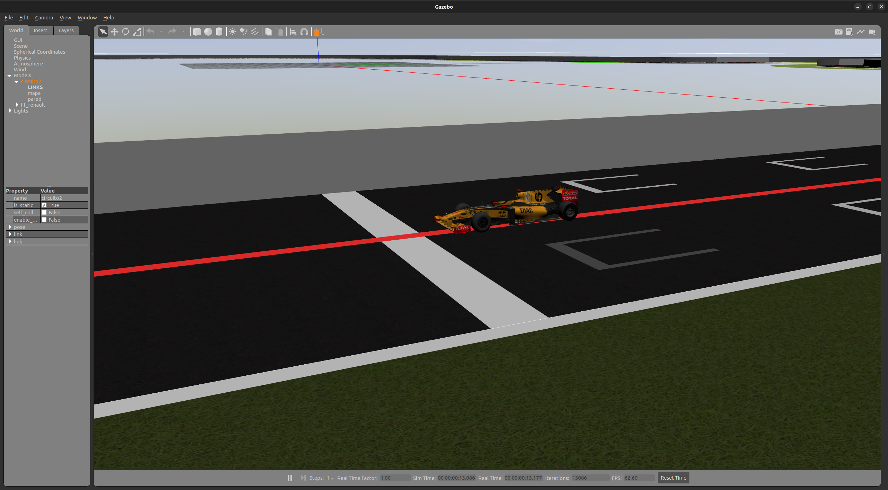
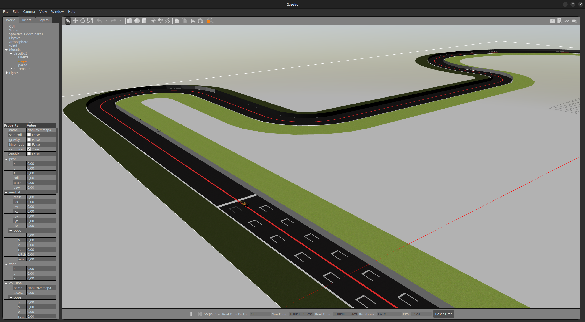

# ROS Seminar

## Index
- [Overview](#overview)
- [First Steps](#first-steps)
- [ROS Interfaces](#ros-interfaces)
- [Troubleshooting](#troubleshooting)
- [Acknowledgements](#acknowledgements)
- [License](#license)

## Overview

Programming a Formula 1 on a race track by following a red line in the center of the road with an RGB camera integrated into the F1 model.




## First Steps

### Setting up the environment
```bash
export GAZEBO_MODEL_PATH=$GAZEBO_MODEL_PATH:$PWD/models
export GAZEBO_RESOURCE_PATH=$GAZEBO_RESOURCE_PATH:$PWD/worlds
```

### Launching
```bash
roslaunch launch/simple_circuit.launch
```

## ROS Interfaces
### Topics
| Topic name | ROS msg | Description |
| ---         | ---     | ---         |
| `/cam/image_raw`   | `sensor_msgs/msg/Image`      | F1 image publisher       |
| `/cam/camera_info` | `sensor_msgs/msg/CameraInfo` | F1 camera info publisher |
| `/odom`            | `nav_msgs/msg/Odometry`      | F1 odometry publisher    |
| `/cmd_vel`         | `geometry_msgs/msg/Twist`    | F1 commander publisher   |

### Services
| Service name | ROS msg | Description |
| ---         | ---     | ---         |
| `/game_logic/start` | `std_srvs/srv/Trigger` | Start Game Logic |
| `/game_logic/stop`  | `std_srvs/srv/Trigger` | Stop Game Logic  |


<!-- ### Parameters -->

## Troubleshooting

```bash
$  gazebo worlds/simple_circuit.world
[INFO] [1675081776.219252956] [gazebo_ros_node]: ROS was initialized without arguments.
[INFO] [1675081776.342421523] [object_controller]: Subscribed to [/cmd_vel]
[INFO] [1675081776.348074673] [object_controller]: Advertise odometry on [/odom]
[INFO] [1675081776.350898997] [object_controller]: Publishing odom transforms between [odom] and [base_footprint]
gzclient: /usr/include/boost/smart_ptr/shared_ptr.hpp:728: typename boost::detail::sp_member_access<T>::type boost::shared_ptr<T>::operator->() const [with T = gazebo::rendering::Camera; typename boost::detail::sp_member_access<T>::type = gazebo::rendering::Camera*]: Assertion `px != 0' failed.
[INFO] [1675081778.089864820] [rclcpp]: signal_handler(signum=2)
```

[Fix](https://answers.ros.org/question/358847/cannot-launch-gzclient-on-a-launch-file-results-in-shared_ptr-assertion-error/):
```bash
 . /usr/share/gazebo/setup.sh 
```

## Acknowledgements
The idea of the exercise, the models and the worlds files are original from [RoboticsAcademy](https://github.com/JdeRobot/RoboticsAcademy) ([JdeRobot](https://github.com/JdeRobot)), where the author is an active maintainer.

## License
The source code is released under [GPLv3](http://www.gnu.org/licenses/) license.
